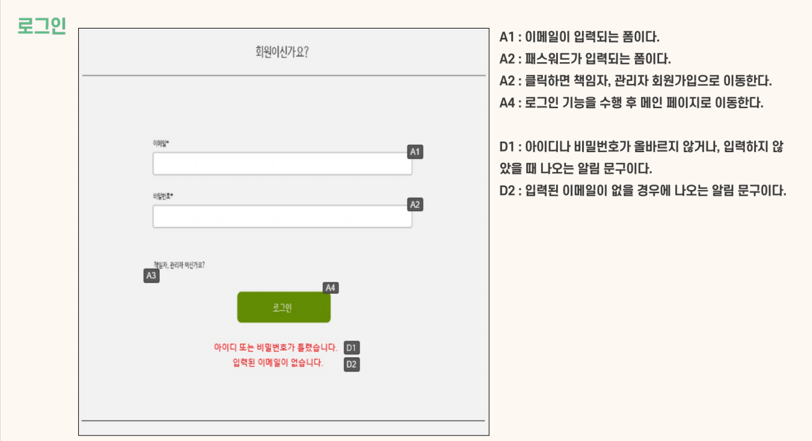

# CooKingdom, 요리 레시피 검색과 밀키트 구매를 한번에
## [시연 영상 바로 보기](https://youtu.be/ZX5bDemHHXQ) 
##### 팀원 : 강수목, 고현민(조장), 곽서현, 김세훈, 박준태
---
## Contents
1. [프로젝트 소개](#프로젝트-소개)
2. [개발환경](#개발환경)
3. [프로젝트 기능구현](#프로젝트-기능구현)
4. [주요기능](#주요기능)
5. [Document](#Document)
---
## 프로젝트 소개
- 레시피 정보 공유 및 밀키트 판매 서비스
- 코로나로 인해 외식이 어려워지는 상황에서 요리를 직접하고자 하는 사람들의 욕구 증가
- 레시피를 직접 보고도 요리하기가 어려운 경우 바로 밀키트를 구매할 수 있도록하는 편의서비스 제공

---
## 개발환경

|Category|Detail|
|:--:|:--:|
|FrontEnd|HTML5, JS, CSS3, JQuery|
|BackEnd|Java(JDK 1.8), Servlet|
|OS|Windows 10, MacOS|
|Libray&API|Apache Commons FileUpload, Imgscalr|
|IDE|Eclipse, VisualStudio|
|Server|Tomcat(v8.5)|
|Document|Google Drive, KakaoOven, ERDCloud, diagrams.net|
|CI|Github|
|DateBase|SQL Developer, Oracle(11g)|

---
## 프로젝트 기능구현
- 박준태
  - 책임자, 관리자, 사용자 로그인 및 회원가입 기능
- 김세훈
  - 레시피 목록 조회, 레시피 정보 조회, 등록, 수정, 삭제 기능
- 곽서현
  - 리뷰 목록 조회, 리뷰 정보 조회, 등록, 수정, 삭제 기능
  - 댓글 목록 조회, 등록, 수정, 삭제 기능
- 고현민
  - 장바구니 조회, 등록, 삭제 기능
- 강수목
  - 주문 목록 조회, 등록, 수정, 삭제 기능

---
## 주요기능
**1. 로그인**

    

---
## Document
